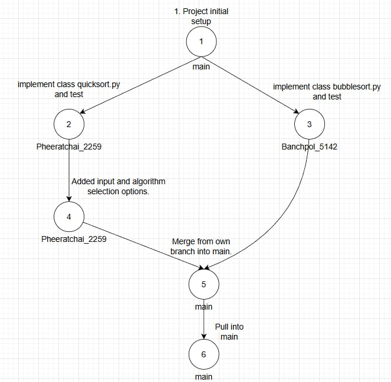

สมาชิก
1.นายพิรัชชัย สืบสิงห์ 663380225-9 sec 2
2.นายเบญจพล บุบผามาลา 663380514-2 sec 2

Teamworkflow

คำอธิบาย
1.เบญจพล Project initial Setup โดยการสร้าง โฟลเดอร์ sorters สำหรับ class ของการ sort โดยในโฟลเดอร์จะมีไฟล์ quicksort.py และ bublbesort.py และสร้างไฟล์ main.py เพื่อสั่งการทำงาน sort บน main branch
2.พีรัชชัยทำการ implement class quicksort.py ใน branch ของ Pheeratchai_2259 และทำการ test 
3.เบญจพลทำการ implement class bubblesort.py ใน branch ของ Banchpol_5142 และทำการ test 
4.พีรัชชัย ทำการเพิ่มการ input และ ตัวเลือก การเลือกใช้ algorithm
5.พีรัชชัย และ เบญจพล ทำการ merge จาก branch ตัวเองเข้าสู่ main
6.Pull เข้าสู่ main